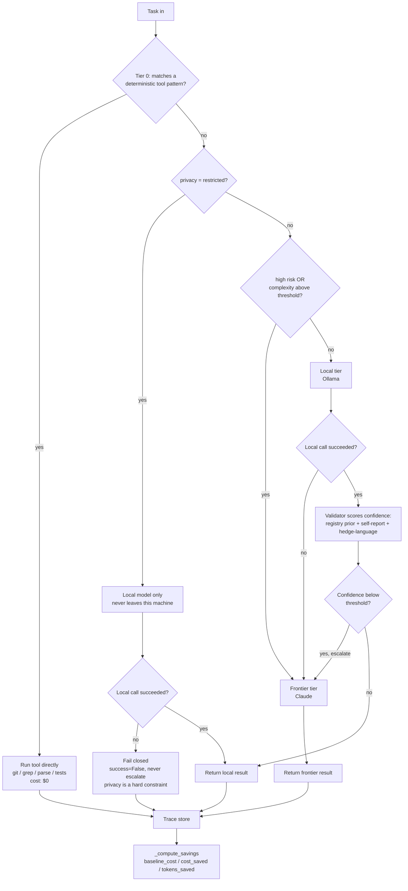
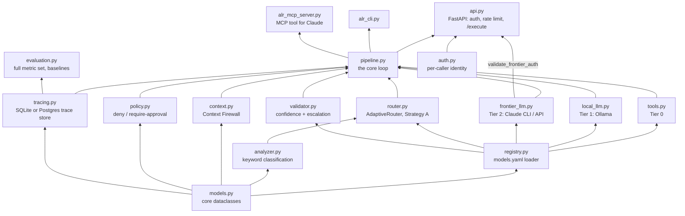

# Architecture

How the Adaptive LLM Router (ALR) is put together: the request flow, the
module layering, and where each piece of state lives. For setup steps
see [SETUP.md](SETUP.md); for the full technical reference (metric
definitions, honest limitations) see [README.md](README.md).

## The core idea

Every task is sent to the **cheapest tier that can plausibly handle
it**, with automatic escalation if that tier's answer looks unreliable:

Three tiers, cheapest first:

| Tier | What runs | Typical cost |
|---|---|---|
| **0 — Tool** | Deterministic code: `git status`, `grep`, JSON/CSV parsing, test runner | $0, always |
| **1 — Local** | A model you run yourself via Ollama | $0 (your own compute) |
| **2 — Frontier** | Claude, via the `claude` CLI (your subscription) or the raw API | Real cost, only when needed |

## Module layering

Each module only depends on the ones below it — swap any single piece
(e.g. replace the rule-based router with a learned classifier) without
touching the rest:

## What happens on one request (the core loop)

`Pipeline.run()` / `run_async()` — section 41's loop, wired together in
`alr/pipeline.py`:

1. **Analyze** (`analyzer.py`) — keyword/heuristic classification into a
   category + complexity score (0–1). A Tier-0 pattern match short-circuits
   everything else.
2. **Route** (`router.py`) — the rule-based Adaptive Routing Engine picks
   tool / local / frontier per the flowchart above.
3. **Check policy** (`policy.py`) — high-risk patterns (`git push`,
   `drop table`, secrets access, ...) get denied or require an
   `approval_callback` before anything runs. Enforced *inside* the
   pipeline, so `/execute` can't bypass it.
4. **Execute** (`tools.py` / `local_llm.py` / `frontier_llm.py`) — the
   actual tool call, Ollama request, or Claude call. Frontier prompts
   pass through the **Context Firewall** (`context.py`) first if raw
   evidence was attached, compressing it before it's ever billed.
5. **Validate + escalate** (`validator.py`) — a successful local result
   gets a blended confidence score (registry prior + the model's own
   self-report + hedge-language detection). Below threshold, the *same
   task* is silently re-routed to frontier — this re-run, not the
   original routing decision, is what ends up in the trace.
6. **Compute savings** (`pipeline.py::_compute_savings`) — what the
   frontier model would have cost for this same response vs. what was
   actually spent.
7. **Trace** (`tracing.py`) — every field above, plus the resolved
   caller identity, persisted as one row.

## Where state lives

| State | Default | Swap in |
|---|---|---|
| Trace store (every task/cost/savings/caller record) | SQLite file (`alr_traces.db`) | Postgres via `DATABASE_URL` — a free Neon tier works with no code change (see README "Cloud trace store") |
| Rate limiter | In-memory token bucket | Redis via `REDIS_URL`, shared across replicas |
| Model registry + capability priors | `alr/config/models.yaml` | Same file, or point at a different path |
| Frontier auth | Your `claude login` session | `CLAUDE_CODE_OAUTH_TOKEN` (headless, subscription) or `ANTHROPIC_API_KEY` (headless, API) |

Nothing here is a hosted service the repo depends on — every piece of
state lives on infrastructure you point it at yourself.

## Three ways in

The same `Pipeline` sits behind all three — none of them are separate
implementations:

- **HTTP API** (`api.py`) — `POST /execute`, `GET /metrics`, auth via
  labeled `ALR_API_KEYS`, refuses to start without valid frontier auth.
- **CLI** (`alr_cli.py`, wrapped by `bin/alr`) — one task in, one result
  out, from a terminal.
- **MCP tool** (`alr_mcp_server.py`) — lets an interactive Claude session
  delegate one self-contained sub-task to the router mid-conversation,
  without routing the whole session through it (which isn't possible —
  see SETUP.md step 14 for why).

## Extension points

- **Router** (`router.py`) — Strategy A (rule-based) today; the doc's
  own roadmap describes Strategy B (learned classifier) once there's
  real trace data to train on. Nothing downstream depends on how routing
  decisions are made, only on the `RouteDecision` shape.
- **Frontier connector** (`frontier_llm.py`) — add a sibling module
  (e.g. `openai_llm.py`) and register it via the registry's `provider`
  field to support another frontier vendor without touching the router.
- **Policy** (`policy.py`) — `approval_callback` is a hook for wiring
  real human-in-the-loop approval (Slack, a queue) in front of
  high-risk operations; out of the box, anything requiring approval is
  denied.
